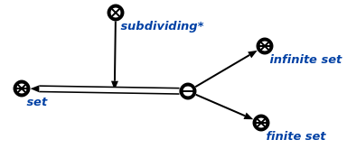
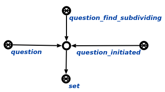

### Agent of search of subdividing of the specified entity

The task of this agent is to search for subdividing of a given entity.

One of subdividing of concept **set**:  

#### Work example

Search for subdividing of **set** concept. 

**Request:**

**Response:**
